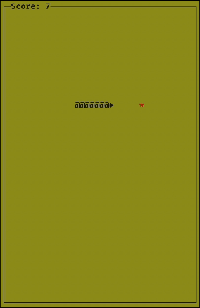

# Snake

Snake on your terminal!

## Note
This is my attempt at speed running this implementation in around an hour. This
uses my previous attempt at [pacman](https://github.com/AravindVasudev/pacman)
as the base to setup the project.

## TODOs
- [x] Die when the snake collides into its own body.
- [ ] Decouple snake's speed from the frame rate.
- [ ] Increase snake speed as the score goes up.
- [x] Make the pellet blink.
- [ ] Add multiple lives.
- [ ] Clean up the UI.
  - [ ] Implement a help window.
  - [ ] Implement multiple screens.

## Building

```
$ make
$ ./bin/snake
```